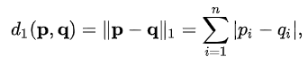
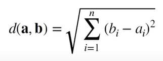
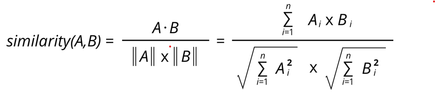
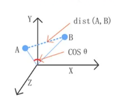

```{r}
#install.packages("philentropy")
#install.packages("readxl")
```

```{r message=FALSE}
library(philentropy)
library(readxl)
```

```{r}
## Import data
data <- read_excel("DataCoba.xlsx")
data <- data[1:8, 2:4]

data <- as.matrix(data)
data
```

## L1 norm

L1 Norm atau juga biasa dikenal sebagai **Manhattan Distance** atau **Taxicab Norm** adalah penjumlahan dari besaran vektor pada suatu ruang.

Berikut contoh manhattan distance dari data point dengan nilai (0,0) dengan (3,4)


Jarak Manhattan distance dari kedua data point tersebut adalah


Manhattan distance ini adalah cara paling umum untuk mengukur jarak antar vektor, yaitu jumlah dari selisih absolut dari tiap-tiap komponen vektor.



```{r message=FALSE}
L1 <- distance(data, method="manhattan")
df_L1 = as.data.frame(t(L1)) # Change to dataframe
df_L1
```

```{r}
# Export to csv
write.csv(df_L1, "export/L1.csv")
```

## L2 norm

L2 norm atau yang biasa dikenal dengan **Euclidean distance** adalah jarak terdekat pada antar **data point**.

Berikut contoh euclidean distance dari data point dengan nilai (0,0) dengan (3,4)


Jarak Euclidean dari kedua data point tersebut adalah


Euclidean distance ini adalah cara yang paling sering digunakan untuk mengukur jarak antar dua titik.



```{r message=FALSE}
L2 <- distance(data, method="euclidean")
df_L2 = as.data.frame(t(L2)) # Change to dataframe
df_L2
```

```{r}
# Export to csv
write.csv(df_L2, "export/L2.csv")
```

## L∞

```{r message=FALSE}
LSup <- distance(data, method="chebyshev")
df_LSup = as.data.frame(t(LSup)) # Change to dataframe
df_LSup
```

```{r}
# Export to csv
write.csv(df_LSup, "export/LSup.csv")
```

# Cosine

Cosine Similarity adalah mengukur kemiripan antara 2 vektor

Berikut adalah rumus hitung dari Cosine Similarity



Analogi dari cosine similarity :



```{r message=FALSE}
# Cosine
LCosine <- distance(data, method="cosine")
df_LCosine = as.data.frame(t(LCosine))
df_LCosine
```

```{r}
# Export to csv
write.csv(df_LCosine, "export/LCosine.csv")
```
